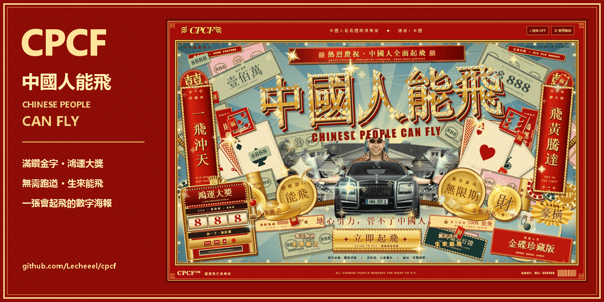

<div align="center">


**縣城首富 × 賭場開業 × 盜版金碟 × 2005 年 Photoshop**

一張會起飛的數字海報。滿鑽金字、八方來財、金光閃閃，生來就要過度設計。


[海報預覽](#海報預覽) · [本地起飛](#本地起飛) · [壁紙下載](docs/images/wallpaper.jpg) · [分享封面](docs/images/social-preview.png)

**無需跑道 · 全憑實力 · 無需許可 · 生來能飛**

</div>

## 海報預覽

點擊圖片查看原尺寸。

[](docs/images/desktop.png)

<div align="center">
<a href="docs/images/mobile.png"></a>
<br>
<sub>手機也要滿。直式一屏，照樣起飛。</sub>
</div>

## 金裝豪華配置

| 配置 | 排面 |
| --- | --- |
| 滿鑽金字 | 立體金色字面、切面碎鑽、金色爪托 |
| 賭場開業 | 跑馬燈、籌碼、金鏈、元寶、撲克牌、成捆現鈔 |
| 立即起飛 | 人車升空、金色紙屑、祝福、累計飛行次數 |
| 鴻運大獎 | 可點擊的老虎機，拉杆、三組轉輪與四種好運祝福 |
| 廉價印刷 | 半調網點、顆粒、色偏、粗糙拼貼 |
| 邊角珠光 | 五種固定星芒，附著在車燈、屋頂、牌角和金幣上 |
| 收藏級附件 | 開業橫幅、雙層竪聯、金碟、頭等艙通行證 |
| 聲光俱全 | 可選合成音效、鼠標視差、動畫暫停、減少動效適配 |

音效預設關閉。老虎機也支援鍵盤 Enter／空格；暫停或減少動態效果時仍可接收祝福。

## 本地起飛

**直接雙擊 `index.html` 即可打開。** 全部網站素材都在本地，無需構建，也無需安裝運行依賴。

也可以使用 Node.js 啟動本地服務：

```sh
git clone https://github.com/Lecheeel/cpcf.git
cd cpcf
npm start
```

打開 **http://localhost:5173**。修改文件後刷新瀏覽器即可。

## 海報、壁紙與分享圖

| 圖片 | 尺寸 / 格式 | 用途 |
| --- | --- | --- |
| [紅金封面](docs/images/banner.svg) | 1280 × 330 · SVG | README 頂部橫幅 |
| [桌面預覽](docs/images/desktop.png) | 1440 × 900 · PNG | 查看完整網站構圖 |
| [手機預覽](docs/images/mobile.png) | 390 × 844 · PNG | 直式海報效果 |
| [桌面壁紙](docs/images/wallpaper.jpg) | 1920 × 1080 · JPG | 背景圖片、壁紙 |
| [分享封面](docs/images/social-preview.png) | 1280 × 640 · PNG | GitHub Social preview / 社交分享 |

[](docs/images/social-preview.png)

分享封面可下載後上傳至 GitHub 倉庫 **Settings → General → Social preview**。README 引用圖片不會自動更改 GitHub 的倉庫分享卡片。

## 文件與素材

| 文件 | 內容 |
| --- | --- |
| `index.html` | 一屏海報結構 |
| `style.css` | 主構圖與基礎動畫 |
| `casino.css` | 跑馬燈、籌碼、金鏈、元寶、邊角星芒 |
| `maximal.css` | 滿鑽字、雕版鈔票、老虎機、牌匾與金碟 |
| `script.js` | 起飛、老虎機、音效、視差、暫停 |
| `assets/` | 網站本地成品素材 |
| `docs/images/` | 倉庫展示圖片與壁紙 |
| `scripts/` | 本地服務、瀏覽器檢查、素材處理與截圖 |

拼貼素材來自使用者提供的參考圖片，包含人物、棕櫚、豪車和豪宅。豪宅原圖的素材站水印保留；圖片權利歸原權利人所有。字體使用系統宋體與襯線字體，不依賴在線字體服務。

`scripts/prepare_assets.py` 使用 Pillow 重新裁切原圖，給汽車和豪宅加入半調網點、印刷色偏與顆粒。此腳本需要本機 `_ref_img/` 原圖；克隆後直接查看網站與運行測試不需要原圖。

Git 已忽略參考原圖、討論記錄、未使用的裁切圖、臨時預覽、依賴目錄和日誌；`docs/images/` 中的展示成品會隨倉庫提交。

## 檢查與更新預覽

瀏覽器檢查使用本機 Microsoft Edge：

```sh
npm install
npm start
# 在另一個終端執行
npm test
```

涵蓋桌面與手機布局、圖片加載、起飛、老虎機、鍵盤操作、音效、暫停與減少動效模式。

重新生成展示圖片（需 Microsoft Edge；分享封面腳本另需 Pillow 和 Windows 微軟雅黑字體）：

```sh
node scripts/capture-gallery.cjs
python scripts/compose-social.py
```

截圖直接打開本地 HTML，不需要啟動服務。

---

<div align="center">

**CPCF™ — 中國人能飛國際俱樂部**

中國總部：中國 · 飛行高度：∞ · 飛行許可：無限期

<sub>ALL CHINESE PEOPLE RESERVE THE RIGHT TO FLY.</sub>

</div>
